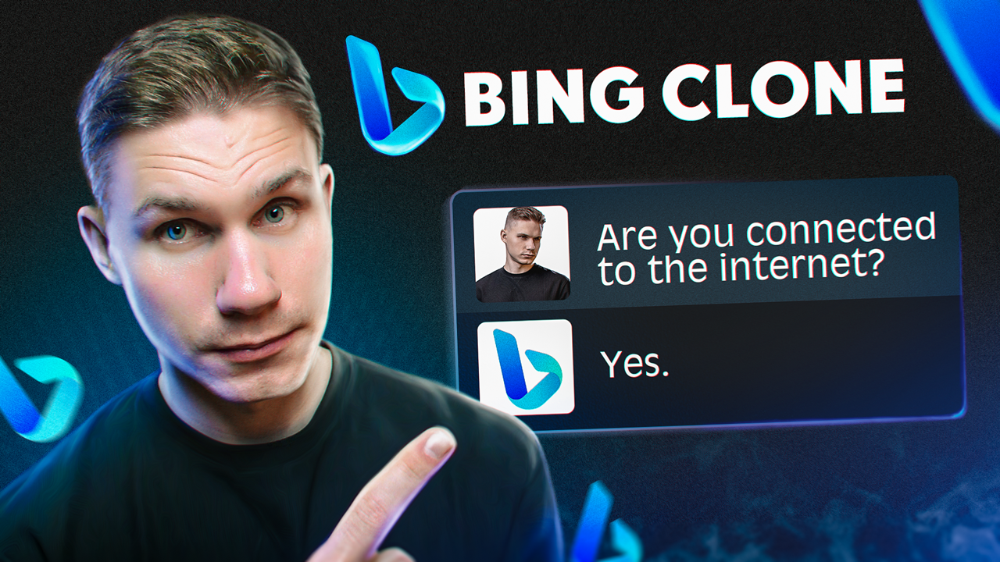

# ChatGPT Bing Clone
Unleash the power of ChatGPT/GPT-4 by connecting it to internet!
[](https://www.youtube.com/watch?v=u9k2djm1Nrw)

[//]: # (![ChatGPT Customized Assistant]&#40;assets/chatgpt-customized-assistant-demo.gif&#41;)

# Getting Started
1. Clone this repository
```bash
git clone https://github.com/VRSEN/chatgtp-bing-clone
```
2. Create a venv and install the requirements:
```bash
python3 -m venv ./venv

.\venv\Scripts\activate

pip install -r requirements.txt
```
3. Get your API key from [OpenAI](https://platform.openai.com/account/api-keys) and set it as an environment variable:
```bash
# Windows
set OPENAI_API_KEY=<your_api_key>
```
```bash
# Mac/Linux
export OPENAI_API_KEY=<your_api_key>
```
4. Get your [programmable serach engine id](https://programmablesearchengine.google.com/controlpanel/all) and [google cloud custom search developer key](https://developers.google.com/custom-search/v1/introduction)
5. Add keys from the last step in code accordingly
___

If you need more a more sophisticated assistant, with payments/production backend/custom UI reach out to me on Fiverr or Upwork:
- [Fiverr](https://www.fiverr.com/arseny9795)
- [Upwork](https://www.upwork.com/freelancers/~01214517c56834a591)
